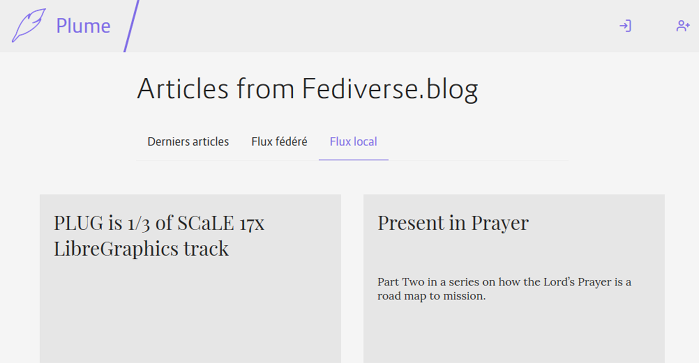

<!--
Este archivo README esta generado automaticamente<https://github.com/YunoHost/apps/tree/master/tools/readme_generator>
No se debe editar a mano.
-->

# Plume para Yunohost

[](https://ci-apps.yunohost.org/ci/apps/plume/)  

[](https://install-app.yunohost.org/?app=plume)

*[Leer este README en otros idiomas.](./ALL_README.md)*

> *Este paquete le permite instalarPlume rapidamente y simplement en un servidor YunoHost.*  
> *Si no tiene YunoHost, visita [the guide](https://yunohost.org/install) para aprender como instalarla.*

## Descripción general

Federated blogging engine, based on ActivityPub. It uses the Rocket framework, and Diesel to interact with the database.


**Versión actual:** 0.7.2~ynh2

**Demo:** <https://joinplu.me/#instances>

## Capturas



## Documentaciones y recursos

- Sitio web oficial: <https://joinplu.me/>
- Documentación administrador oficial: <https://docs.joinplu.me/>
- Repositorio del código fuente oficial de la aplicación : <https://github.com/Plume-org/Plume>
- Catálogo YunoHost: <https://apps.yunohost.org/app/plume>
- Reportar un error: <https://github.com/YunoHost-Apps/plume_ynh/issues>

## Información para desarrolladores

Por favor enviar sus correcciones a la [`branch testing`](https://github.com/YunoHost-Apps/plume_ynh/tree/testing

Para probar la rama `testing`, sigue asÍ:

```bash
sudo yunohost app install https://github.com/YunoHost-Apps/plume_ynh/tree/testing --debug
o
sudo yunohost app upgrade plume -u https://github.com/YunoHost-Apps/plume_ynh/tree/testing --debug
```

**Mas informaciones sobre el empaquetado de aplicaciones:** <https://yunohost.org/packaging_apps>
